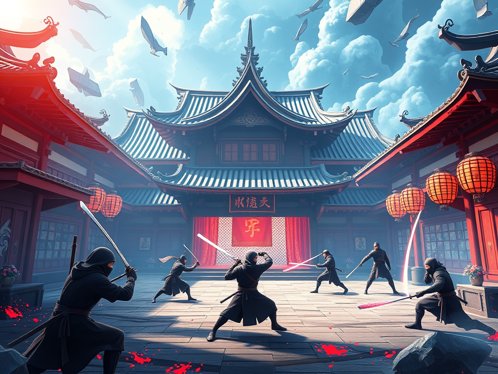

# Web3 Ninja: The Future of Ninja Metaverses

Welcome to **Web3 Ninja**, an ambitious game studio project that fuses AAA-level ninja gameplay with cutting-edge Web3 technology. This monorepo includes both the **frontend (React + Vite + TypeScript)** and **backend (Node.js + Express)** services powering the Web3 Ninja experience.

---

## Product Summary

**Web3 Ninja** is a futuristic ninja-themed metaverse game redefining interactive entertainment for the decentralized world. Master stealth, strategy, and swordplay in a universe where assets are owned, earned, and evolved by players. 

From AI-powered NPCs to DAO-governed villages, we’re building an ecosystem where gameplay, economy, and community merge — and you’re invited to join the dojo.

---


## 🎯 Vision

To create a **legendary ninja metaverse** that is:

- Exhilarating & immersive  
- Empowering & community-driven  
- Fully decentralized  

Players will **own, shape, and earn** from the worlds they explore.

---

## 🛡️ Mission

- **Gamify Decentralization:** Build a AAA-level game on blockchain rails  
- **Empower Ninjas:** NFTs, DAO governance & play-to-earn mechanics  
- **Fuse Art & Code:** Design + AI-driven gameplay = shadow strike precision  
- **Bridge Web2 & Web3:** Seamless onboarding for both traditional gamers and crypto natives
    
---

## 💻 Getting Started

```bash
# Clone the repo
git clone https://github.com/loopcrewhub/Web3-Ninja-Dojo.git
cd web3-ninja

# Install dependencies
npm install

# Run client + server in dev mode
npm run dev
```

---
